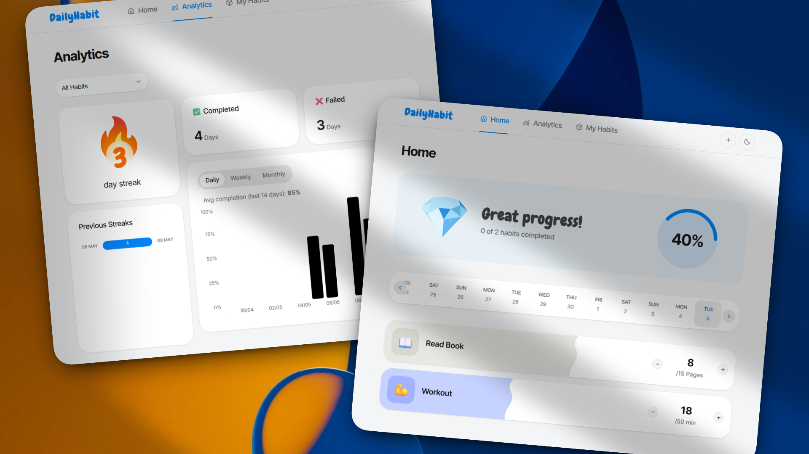

# DailyHabit - Simple Habit Tracker

  



 
* 🎮 Live Demo: https://daily-habit-umber.vercel.app/
* 📹 YouTube Tutorial: [https://youtube.com](https://youtu.be/U6cd310jHC8)
* 👤 Creator: [@souhail_dev](https://x.com/souhail_dev)
  

## 📋 Overview

  

**DailyHabit** is a beautiful, feature-rich habit tracking application designed to help users build and maintain daily habits through an intuitive interface and powerful analytics. Built with cutting-edge web technologies and best practices, this app showcases modern React development patterns.

  

## ✨ Key Features

  

### 🎯 Habit Management

-  **Custom Habit Creation**: Define habits with personalized goals, units, emojis, and colors

-  **Daily Tracking**: Mark habit completion and track progress with satisfying interactions

-  **Archive System**: Cleanly manage completed or paused habits

-  **Smart Organization**: 11 color options for visual categorization

  

### 📊 Analytics & Insights

-  **Progress Visualization**: Beautiful charts showing habit streaks and completion rates

-  **Daily Progress Banner**: Real-time overview of daily achievements

-  **Historical Data**: Track long-term trends and patterns

-  **Statistics Dashboard**: Comprehensive analytics powered by Recharts

  

### 🎨 User Experience

-  **Responsive Design**: Seamless experience on mobile and desktop

-  **Dark/Light Theme**: System-aware theme switching with smooth transitions

-  **Micro-interactions**: Delightful animations and celebrations for habit completion

-  **Keyboard Navigation**: Full accessibility support with hotkeys

  

### 💾 Data & Privacy

-  **Local Storage**: All data stored locally using RxDB for complete privacy

-  **Real-time Updates**: Reactive data streams for instant UI updates

  

## 🛠 Tech Stack

  

### Frontend Framework

-  **Next.js 16.2.4** (App Router) - Modern React framework with server components

-  **React 19.2.4** - Latest React with concurrent features

-  **TypeScript 5** - Type-safe development

  

### UI & Styling
-  **Root UI** - Premium Shadcn Components, Blocks and Themes.

-  **Tailwind CSS 4** - CSS-first configuration with OKLCH color space

-  **shadcn 4.5.0** - Beautiful, accessible component library

-  **@base-ui/react** - Modern React component primitives

-  **Motion** - Smooth animations and transitions

-  **Lucide React** - Consistent icon system

  

### Data & State

-  **RxDB** - Reactive database for local data storage

-  **React Hooks** - Custom hooks for data fetching and state management

-  **TypeScript Schemas** - Type-safe data models

  

### Additional Libraries

-  **Recharts** - Data visualization and analytics charts

-  **Lottie React** - Lottie animations

-  **date-fns & dayjs** - Date manipulation utilities

-  **next-themes** - Theme management


## 🚀 Getting Started

  

### Prerequisites

- Node.js 18+

- Bun (recommended) or npm/yarn

  

### Installation

  

1.  **Clone the repository**

```bash

git  clone https://github.com/benlhachemi/daily-tracker

cd  daily-tracker

```

  

2.  **Install dependencies**

```bash

bun  install

# or

npm  install

```

  

3.  **Start development server**

```bash

bun  dev

# or

npm  run  dev

```

  

4.  **Open your browser**

Navigate to [http://localhost:3000](http://localhost:3000)

  

### Available Scripts

  

```bash

bun  dev  # Start development server (port 3000)

bun  build  # Production build

bun  start  # Start production server

bun  lint  # Run ESLint checks

```

  

## 📁 Project Structure

  

```

daily-tracker/

├── app/ # Next.js App Router

│ ├── (home)/ # Home route with habit tracking

│ ├── analytics/ # Analytics dashboard

│ ├── my-habits/ # Habit management

│ ├── globals.css # Global styles with Tailwind

│ └── layout.tsx # Root layout

├── components/ # React components

│ ├── ui/ # shadcn UI components

│ ├── blocks/ # Layout components

│ ├── *.tsx # Feature components

├── db/ # Database configuration

│ ├── schemas/ # RxDB schemas

│ ├── index.ts # Database setup

│ └── types.ts # TypeScript types

├── hooks/ # Custom React hooks

├── lib/ # Utility functions

├── providers/ # React context providers

└── assets/ # Static assets

```

  

## 🎯 Core Concepts

  

### Data Models

  

**Habit Schema**

```typescript

interface  Habit {

id: string;

name: string;

color: HabitColor; // 11 predefined colors

emoji: string;

goal: number;

unit: string;

timestamp: string;

isArchived: boolean;

archivedAt: string;

}

```

  

**Habit Log Schema**

```typescript

interface  HabitLog {

id: string;

habitId: string;

timestamp: string;

value: number;

completed: boolean;

}

```

  

### Key Components

-  **CreateHabitCard**: Form for creating new habits with validation

-  **HabitCard**: Interactive habit tracking with progress indicators

-  **AnalyticsChart**: Data visualization using Recharts

-  **DailyProgressBanner**: Real-time daily achievement overview

-  **HorizontalDatePicker**: Intuitive date navigation

  

## 🎨 Design System

  

### Color Palette

- OKLCH color space for better consistency

- 11 habit colors for categorization

- Dark/light theme variants

- High contrast accessibility support

  

### Animation Principles

- Smooth transitions using Motion library

- Stagger animations for list items

- Celebration animations for habit completion

- Loading states and micro-interactions

  

## 🔧 Development Guidelines

  

### Code Standards

- TypeScript strict mode enabled

- ESLint with Next.js and TypeScript presets

- Path alias `@/*` for clean imports

- Component naming: PascalCase for components

  

### Styling Conventions

- Tailwind CSS 4 with CSS-first configuration

- Mobile-first responsive design

- Component-driven architecture

- Accessibility-first approach

  

### Database Best Practices

- RxDB reactive queries for real-time updates

- Proper error handling for database operations

- Schema validation for data consistency

- Offline-first design patterns


## 🤝 Contributing

  

This project is part of a YouTube tutorial video. While contributions are welcome, the primary goal is to serve as a learning resource.


### Development Workflow

1. Fork the repository

2. Create a feature branch

3. Make your changes

4. Submit a pull request


## 📄 License

 

This project is open source and available under the [MIT License](https://github.com/benlhachemi/daily-tracker/blob/main/LICENSE).

 

  

## 🙏 Acknowledgments

  
- [Root UI](https://rxdb.info/) - Shadcn Components & Blocks Library

- [Next.js](https://nextjs.org/) - The React framework

- [shadcn/ui](https://ui.shadcn.com/) - Beautiful component library

- [RxDB](https://rxdb.info/) - Reactive database

- [Tailwind CSS](https://tailwindcss.com/) - Utility-first CSS framework

- [Motion](https://motion.dev/) - Animation library

  

---
